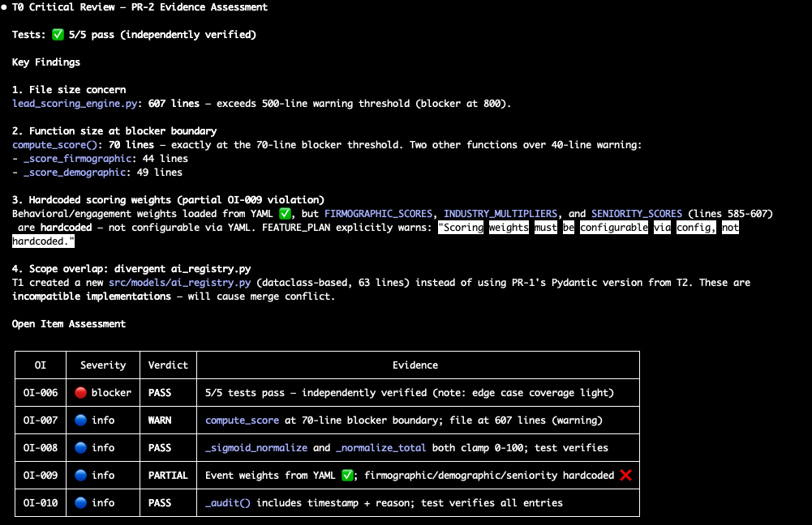

# VNX — Glass Box Governance for Multi-Agent AI

> Reference architecture and working prototype by Vincent van Deth.
> Full write-up on [vincentvandeth.nl/blog](https://vincentvandeth.nl/blog).

Portable orchestration toolkit for multi-agent terminal workflows.
Coordinates AI coding agents (Claude Code, Codex CLI, Gemini CLI) across parallel tmux panes with an append-only receipt ledger, dispatch queue, quality gates, and smart context injection — each dispatch is automatically enriched with relevant code patterns and documentation sections from your codebase.


*T0 orchestrator dispatching work to 3 parallel terminals — Codex CLI (T1), Claude Code Sonnet (T2), Claude Code Opus (T3) — with real-time terminal status tracking.*

## Prerequisites

| Tool | Required | Notes |
|------|----------|-------|
| **tmux** | Yes | Orchestration runs inside a tmux session (2x2 grid) |
| **bash** | Yes | All scripts are bash/python |
| **python3** | Yes | Receipt processing, state management, intelligence |
| **git** | Yes | Provenance tracking per receipt |
| **iTerm2** | Recommended | Best tmux experience on macOS (native pane titles, mouse support) |
| **jq** | Recommended | Used for hook injection and state queries |
| **fswatch** | Recommended | File watcher for receipt processor (falls back to polling) |
| At least one AI CLI | Yes | `claude` (Claude Code), `codex`, or `gemini` |

Install on macOS:

```bash
brew install tmux jq fswatch
```

## Quickstart

```bash
# 1. Clone
git clone https://github.com/Vinix24/vnx-orchestration.git
cd vnx-orchestration

# 2. Install into your project
./install.sh /path/to/your/project

# 3. Initialize, validate, and launch
cd /path/to/your/project
.vnx/bin/vnx bootstrap-skills     # Copy skills to .claude/, .agents/, .gemini/
.vnx/bin/vnx bootstrap-terminals  # Create terminal CLAUDE.md files
.vnx/bin/vnx doctor               # Validate toolchain and layout
.vnx/bin/vnx start                # Launch tmux session (interactive profile selection)
```

`vnx start` creates a tmux session with a 2x2 grid:

```
┌──────────────────┬──────────────────┐
│  T0 (orchestrator)│  T1 (Track A)    │
│  Claude Opus     │  Claude / Codex  │
│                  │  / Gemini CLI    │
├──────────────────┼──────────────────┤
│  T2 (Track B)    │  T3 (Track C)    │
│  Claude / Codex  │  Claude Opus     │
│  / Gemini CLI    │  deep specialist │
└──────────────────┴──────────────────┘
```

### Multi-provider profiles

`vnx init` automatically creates four provider profiles in `.vnx-data/profiles/`.
When you run `vnx start` in an interactive terminal, a selection menu appears:

```
Available profiles:
  1) claude-codex
  2) claude-gemini
  3) claude-only
  4) full-multi

  Select profile [1-4]:
```

Or pass a profile directly to skip the menu:

```bash
.vnx/bin/vnx start                          # Interactive menu (interactive terminal only)
.vnx/bin/vnx start --profile claude-only    # All Claude Code
.vnx/bin/vnx start --profile claude-codex   # T1: Codex CLI, T2: Claude
.vnx/bin/vnx start --profile claude-gemini  # T1: Gemini CLI, T2: Claude
.vnx/bin/vnx start --profile full-multi     # T1: Codex, T2: Gemini
```

T0 (orchestrator) and T3 (deep specialist) always run Claude Opus.
Profile `.env` files are idempotent — edit them freely to customize provider assignments.

## Demo (no LLM required)

### Smoke test (pipeline validation)

```bash
.vnx/bin/vnx smoke
```

Creates an isolated temp workspace, writes a test report, runs the receipt processor
in one-shot mode, and verifies a receipt was appended to the ledger. Pass `--keep` to inspect artifacts after the run.

### Dry-run replay (governance lifecycle)

Replay a real 6-PR demo session with full governance pipeline — no API calls needed.
Uses actual receipts, dispatches, and quality verdicts from a live LeadFlow demo.

```bash
cd demo/dry-run
bash replay.sh          # Normal speed (2s between steps)
bash replay.sh --fast   # Fast mode (0.5s between steps)
```

See [demo/dry-run/README.md](demo/dry-run/README.md) for evidence file details.

### Dry-run replay (context rotation)

Demonstrates automatic context rotation: when an agent's context window fills up,
VNX intercepts the next tool call, triggers a structured handover, clears the session,
and resumes with the same dispatch, same skill, and a fresh context window.

```bash
cd demo/dry-run-context-rotation
bash replay.sh          # Normal speed (2s between steps)
bash replay.sh --fast   # Fast mode (0.5s between steps)
```

Shows the full hook chain: `vnx_context_monitor.sh` (PreToolUse block at 65%) →
`vnx_handover_detector.sh` (PostToolUse stop) → `vnx_rotate.sh` (/clear + skill recovery + continuation).
See [demo/dry-run-context-rotation/README.md](demo/dry-run-context-rotation/README.md) for details.

## How It Works


*The dispatch queue popup (Ctrl+G) shows pending tasks with full context — role, track, gate, priority, and instructions. Human approves, rejects, or edits before any agent receives work.*

1. **T0 dispatches** a task to a worker terminal via the dispatch queue
2. **Worker executes** the task using its AI CLI (Claude Code, Codex, etc.)
3. **Worker writes a report** to `unified_reports/` when done
4. **Receipt processor** detects the report and appends a structured receipt to the NDJSON ledger
5. **T0 gets notified** and can inspect the receipt for status, cost, duration, and git provenance

All state lives on the filesystem. No database, no cloud dependency, no lock-in.

### Context rotation

Long-running tasks can exhaust an agent's context window. VNX handles this automatically:

1. **Monitor** — a PreToolUse hook tracks context usage per terminal. At 50% it logs a warning; at 65% it blocks the next tool call and instructs the agent to write a structured handover document (completed work, remaining tasks, files modified).
2. **Detect** — a PostToolUse hook detects the handover Write, emits a `context_rotation` receipt, and stops the agent (`{"continue":false}`).
3. **Rotate** — a background script sends `/clear` to the terminal, recovers the original skill and dispatch ID from the handover, and sends a continuation prompt with the same skill activated.
4. **Resume** — the agent starts fresh, reads the handover + original dispatch, and picks up where the previous session left off.

The dispatch ID is preserved across sessions, so the receipt ledger maintains a complete chain: `task_started → context_pressure → context_rotation → context_rotation_continuation → task_complete`. Zero human intervention, zero lost work.

See the [context rotation dry-run demo](demo/dry-run-context-rotation/) for a visual walkthrough.



*T0 performs evidence-based quality review: key findings, severity-tagged open items, and pass/warn/partial verdicts — before deciding whether to approve, hold, or redispatch.*

## Commands

| Command | Description |
|---------|-------------|
| `vnx init` | Create runtime directories and config |
| `vnx doctor` | Validate toolchain, layout, and path hygiene |
| `vnx smoke` | One-shot receipt pipeline test (offline, no LLM) |
| `vnx start` | Launch tmux session with orchestration components |
| `vnx cost-report` | Aggregate model usage and estimated cost from receipts |
| `vnx update` | Pull latest VNX from origin and re-install |
| `vnx bootstrap-skills` | Create/link AI CLI skills from shipped templates |
| `vnx bootstrap-terminals` | Create terminal CLAUDE.md files from templates |
| `vnx patch-agent-files` | Idempotent snippet patching for CLAUDE.md / AGENTS.md |
| `vnx package-check` | Fail if runtime artifacts exist inside dist |

## Updating

After VNX is installed in a project, pull the latest version with:

```bash
.vnx/bin/vnx update
```

This clones the latest release, runs `install.sh`, and preserves your runtime data.

## Architecture & Methodology

| Document | Description |
|----------|-------------|
| [Architecture](docs/manifesto/ARCHITECTURE.md) | Glass Box Governance: the four-pillar design |
| [Dispatch Guide](docs/DISPATCH_GUIDE.md) | How dispatches work: feature plans, terminal locking, and parallel execution |
| [Open Method](docs/manifesto/OPEN_METHOD.md) | How VNX was built — AI as junior developer, not autopilot |
| [Limitations](docs/manifesto/LIMITATIONS.md) | Tested scope, known gaps, and design constraints |

## Project layout after install

```
your-project/
├── .vnx/              # VNX system (installed from this repo)
│   ├── bin/vnx        # Main CLI entrypoint
│   ├── scripts/       # Orchestration scripts (dispatcher, supervisor, etc.)
│   ├── dashboard/     # Real-time monitoring dashboard
│   ├── skills/        # Shipped skill templates
│   └── docs/          # Architecture and operations docs
├── .claude/skills/    # Claude Code skills (copied by bootstrap-skills)
├── .agents/skills/    # Codex CLI skills (project-local, copied by bootstrap-skills)
├── .gemini/skills/    # Gemini CLI skills (project-local, copied by bootstrap-skills)
└── .vnx-data/         # Runtime state (never commit)
    ├── profiles/      # Provider selection .env files (auto-created by vnx init)
    ├── dispatches/    # Dispatch queue (pending → active → completed/failed)
    ├── receipts/      # NDJSON ledger
    └── logs/          # Supervisor and component logs
```

## CI

Two GitHub Actions workflows run on every push to `main` and on PRs:

- **`public-ci.yml`** — Install + doctor validation, gitleaks secret scan
- **`vnx-ci.yml`** — Profile A (doctor + core pytest suites), Profile B (PR queue integration)

Offline-only (no secrets, no API calls, no LLM).

## Contributing

See [CONTRIBUTING.md](CONTRIBUTING.md) for guidelines.

- Maintainer focus: governance architecture, reliability, and practical multi-terminal operation.
- Most valuable contributions: test coverage, failure-mode hardening, provider adapters, and docs clarity.
- Collaboration style: small, reviewable PRs with evidence (tests/logs/behavior proof).
- Future direction: contributions toward a Rust/Go production engine are especially welcome.
- Background and intent: see [Open Method](docs/manifesto/OPEN_METHOD.md).

## Security

See [SECURITY.md](SECURITY.md).

## Blog Series

Building VNX in public — architecture decisions, failure modes, and lessons from shipping AI orchestration:

[vincentvandeth.nl/blog](https://vincentvandeth.nl/blog)

## Contact

Questions, ideas, or feedback? Open a thread in [GitHub Discussions](https://github.com/Vinix24/vnx-orchestration/discussions).

## License

MIT. See [LICENSE](LICENSE).
