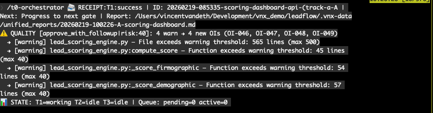

# VNX Manifesto

VNX is a governance-first architecture for multi-agent AI workflows.

Core idea: orchestration is not enough. If you cannot audit decisions, enforce gates, and reconstruct what happened after a failure, you cannot trust multi-agent execution at scale.

This folder is the public narrative: architecture, method, limits, and roadmap.

## In Action


_Parallel execution with explicit manager decisions (T0), not uncontrolled agent fan-out._



_Completion is evidence-based: warnings are surfaced and tracked before closure._

## What VNX Solves

- Turns agent activity into an auditable receipt ledger (`NDJSON`), not opaque chat state.
- Enforces human approval gates between dispatch proposal and execution.
- Stays model/provider-agnostic through watcher-based observation (hooks optional).
- Adds async quality advisories (size, dead code, hygiene) before final closure.
- Keeps a clear chain-of-custody from dispatch to deliverable.

## What Readers Can Verify In 5 Minutes

- Governance gates exist between proposal and execution (`staging -> queue` + human confirmation).
- Receipts form an auditable event trail (`dispatch`, `ack`, `completion`, `quality advisory`).
- Multi-terminal orchestration is explicit (`T0/T1/T2/T3` with readable status and role boundaries).
- Quality checks run as async advisories and can force structured follow-up work.
- Provider coupling is reduced through watcher-based observation.

## Who This Is For

- Engineers running Claude/Codex/Gemini in parallel terminals.
- Builders who need governance and traceability, not just “agent swarms”.
- Teams experimenting with local-first, file-based orchestration patterns.

## Quick Start (Docs-First)

If this is your first read, use this order:

1. `ARCHITECTURE.md` — full system model and why it exists.
2. `ARCHITECTURAL_DECISIONS.md` — key tradeoffs and constraints.
3. `OPEN_METHOD.md` — transparency on build process and provenance.
4. `LIMITATIONS.md` — tested scope and known boundaries.
5. `ROADMAP.md` — what is next.

## Clone

Use the repo URL where you publish VNX:

```bash
git clone <YOUR_VNX_REPO_URL>
cd <YOUR_VNX_REPO_DIR>/docs/manifesto
```

## Visual Proof Pack

Screenshots are managed in one place:

- `SCREENSHOTS.md` — required captures, naming, and placement.
- `assets/screenshots/` — screenshot files.
- `assets/diagrams/` — diagram exports.

## Document Index

| File | Description |
|------|-------------|
| `ARCHITECTURE.md` | Glass Box Governance architecture (full narrative) |
| `ARCHITECTURE_DIAGRAM.mermaid` | Mermaid source for architecture visual |
| `ARCHITECTURAL_DECISIONS.md` | Design decisions and tradeoffs |
| `OPEN_METHOD.md` | Build methodology and provenance transparency |
| `EVOLUTION_TIMELINE.md` | Condensed technical evolution |
| `ROADMAP.md` | Planned extensions and future tracks |
| `LIMITATIONS.md` | Explicit scope and constraints |
| `SCREENSHOTS.md` | Screenshot pack and capture guidelines |

## Current Status

- Validated in local multi-terminal workflows.
- Governance primitives are in place (receipts, gates, advisories).
- Public history starts at repo separation from a private incubator project.

For implementation detail, see the main repository scripts and docs outside this manifesto folder.

## Implementation Lives Here

- Runtime scripts and orchestration logic: `.claude/vnx-system/scripts/`
- Main CLI entrypoint: `.claude/vnx-system/bin/vnx`
- Terminal and skills configuration: `.claude/terminals/` and `.claude/skills/`
- Local runtime state (queues, receipts, snapshots, logs): `.vnx-data/`
- Dashboard assets and serving logic: `.claude/vnx-system/dashboard/`

## Contributing / Collaboration

- Current maintainer focus: architecture, governance model, and practical reliability in local workflows.
- High-value contributions: robustness improvements, cross-provider adapters, test coverage, and docs quality.
- Especially welcome: Rust/Go-oriented contributors for a future production-grade engine.
- Collaboration style: small, reviewable changes with clear evidence (tests, logs, and behavior proof).
